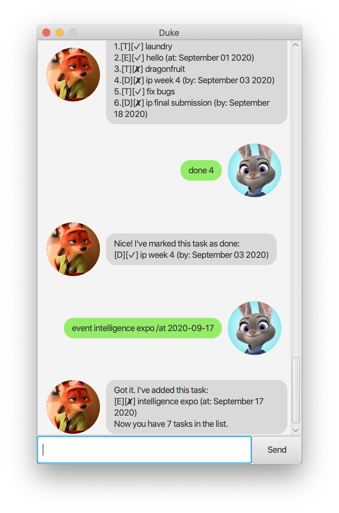

# User Guide



## Features 

### Feature 1: Help command
Displays a help manual for the application.

### Feature 2: Add command
Adds a task (can be a to-do, deadline or an event) to the task list.

### Feature 3: List command
List all tasks in the task list with information such as type, status, and (possibly) date.

### Feature 4: Done command
Marks a specified task as done.

### Feature 5: Delete command
Deletes a specified task from the list.

### Feature 6: Find command
Displays all tasks associated with a specified keyword.

### Feature 7: Completed command
Displays all past tasks that have been marked as completed.

### Feature 8: Pending command
Displays all tasks that have yet to be completed.

### Feature 9: Show command
Displays all tasks happening / due on a certain date.

### Feature 10: Exit command
Exits the bot by issuing a command.

## Usage


### `help` - Displays the help manual

Displays a manual that shows all the available commands.

Example of usage: 

`help`

Expected outcome:

```
Welcome to Duke's help utility!
To list all tasks on your agenda, type `list`.
To terminate the application, type `bye`.
To add a new ToDo, type `todo {description}`.
To add a new Event, type `event {description} /at {yyyy-mm-dd}.
To add a new Deadline, type `deadline {description} /by {yyyy-mm-dd}.
To mark a task as completed, type `done {index}`.
To delete a task, type `delete {index}`.
To find all tasks containing certain keywords, type `find {keywords}`.
To list all completed tasks, type `completed`.
To list all pending tasks, type `pending`.
To list all tasks that happen or due on a certain date, type `show {yyyy-mm-dd}`.
```

### `todo <description>` - Adds a new to-do

Adds a new task of type to-do to the list of tasks.

Example of usage: 

`todo Submit iP final product`

Expected outcome:

```
Got it. I've added this task:
[T][✘] Submit iP final product
Now you have 1 task in the list.
```

### `event <description> /at <date in yyyy-mm-dd>` - Adds a new event

Adds a new task of type event at the specified date to the list of tasks.

Example of usage: 

`event Intelligence Expo /at 2020-09-17`

Expected outcome:

```
Got it. I've added this task:
[E][✘] Intelligence Expo (at: September 17 2020)
Now you have 2 tasks in the list.
```

### `deadline <description> /by <date in yyyy-mm-dd>` - Adds a new deadline

Adds a new task of type deadline due on the specified date to the list of tasks.

Example of usage: 

`deadline iP final submission /by 2020-09-18`

Expected outcome:

```
Got it. I've added this task:
[D][✘] iP final submission (by: September 18 2020)
Now you have 3 tasks in the list.
```

### `list` - Displays all your tasks

Display a full list of all the tasks you have added so far.

Example of usage: 

`list`

Expected outcome:

```
Here are the task(s) in your agenda:
1.[T][✓] Do laundry 
2.[D][✘] CS2103T iP final submission (by September 18 2020)
3.[E][✘] Intelligence Expo (at September 17 2020)
```

### `bye` - Exits the application

Terminates the application.

Example of usage: 

`bye`

### `done <task index>` - Marks a task as done

Marks the task at the specified index as done. The index follows from the output of the list command.

Example of usage:

`done 1`

Expected outcome:

```
Nice! I've marked this task as done:
[T][✓] Submit iP final product
```

### `delete <task index>` - Deletes a task

Deletes a task at the given index from the task list. The index follows from the output of the list command.

Example of usage:

`delete 1`

Expected outcome:

```
Noted. I've removed this task:
[T][✓] Submit iP final product
Now you have 2 tasks in the list.
```

### `find <1st keyword> <2nd keyword> ...` - Finds all tasks associated with keyword(s)

Finds and displays all tasks associated with any of the specified keyword(s).

Example of usage:

`find iP CS2103T`

Expected outcome:

```
Here are the task(s) containing keyword(s): [iP, CS2103T]
1.[D][✘] CS2103T iP final submission (by September 18 2020)
```

### `completed` - Displays all completed tasks

Displays a list of all tasks that have been completed so far.

Example of usage:

`completed`

Expected outcome:

```
Here are the task(s) that have been completed:
1.[D][✓] CS2105 lab 2 (by September 23 2020)
```

### `pending` - Displays all pending tasks

Displays a list of all tasks that have yet to be completed so far.

Example of usage:

`pending`

Expected outcome:

```
Here are the task(s) that have been completed:
1.[D][✘] CS2103T iP final submission (by September 18 2020)
2.[T][✘] Email Trump
```

### `show <date in yyyy-mm-dd>` - Displays all tasks on the given date

Displays a list of tasks happening on or due on the given date.

Example of usage:

`show 2020-09-17`

Expected outcome:

```
Here are the task(s)/deadline(s) happening on: 2020-09-17
1.[E][✘] Intelligence Expo (at: September 17 2020)
```

### `bye` - Terminates the application

Exits the application.

Example of usage:

`bye`
